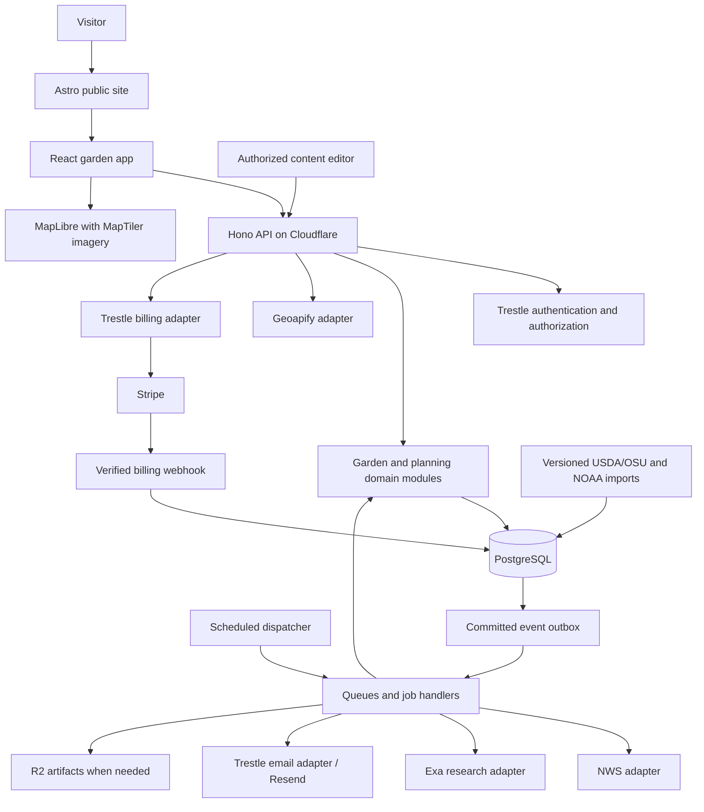
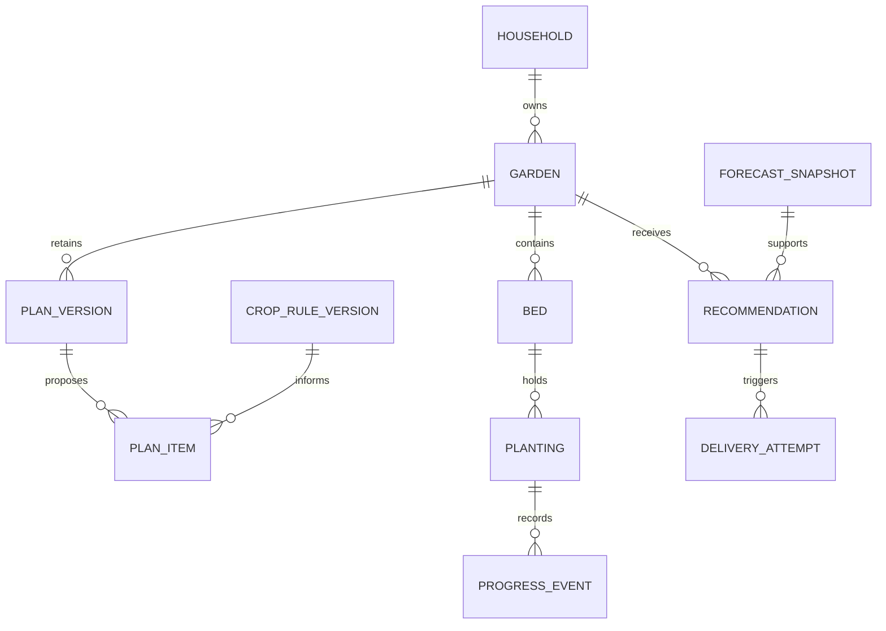
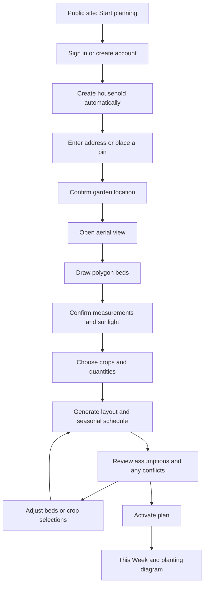
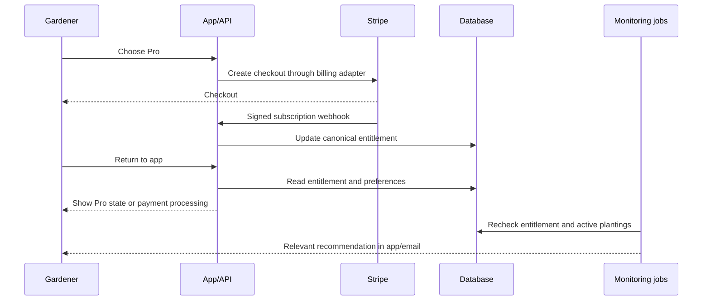
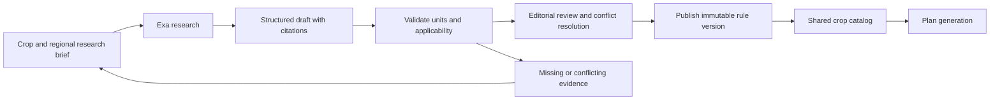
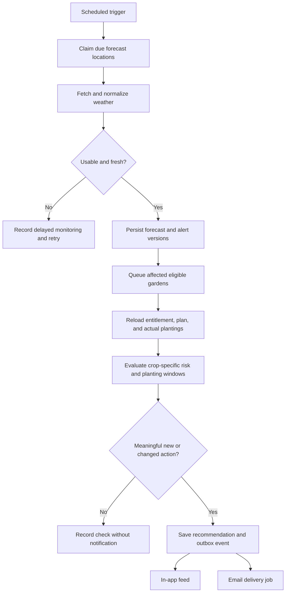

# Easy Garden Plan — System Architecture and Flows

Date: September 24, 2026  
Status: proposed architecture based on accepted product decisions; not an implementation specification.  
References: [Product plan](01-highlevel-plan.md), [Feasibility and provider decisions](02-feasibility.md).

## 1. Architectural direction

Build one Trestle application with clearly separated domain modules, a public marketing site, an authenticated garden-planning app, and background processing. PostgreSQL owns application state. Cloudflare runs the API and background work. External providers supply data through replaceable adapters.

Keep three kinds of information separate:

1. **Shared knowledge:** published crop rules, regional guidance, climate datasets, and provider forecast snapshots.
2. **Private garden records:** locations, polygon beds, preferences, plans, actual plantings, and completed tasks.
3. **Recommendations:** explainable suggestions derived from the first two, with their own history and delivery state.

The application should generate and display an existing garden plan without calling Exa or requiring a fresh weather response. Weather monitoring adds timely guidance to that durable plan.

### Accepted scope

- All US regions at launch, including Alaska and Hawaii; no single-region launch restriction.
- Arbitrary valid polygon beds, including concave shapes.
- Aerial imagery during garden setup, with a diagram fallback where imagery is poor or unavailable.
- A broad vegetable and herb library built with Exa research; no fixed 20-crop cap.
- Free layout and seasonal schedule; Pro near-term planting recommendations and frost alerts.
- Email and in-app notifications initially. Manual sunlight assessment.
- Trestle from `/Users/gregmushen/work/code/gstack` **main**, not the currently checked-out branch. Inspected baseline: `51bf4d6500657c240515955881eeb9f556cd5925`.

The proposals below fill in routine architecture choices. Exact schemas, endpoints, queues, pricing amounts, and implementation tickets belong in subsequent specifications.

## 2. System overview

This is a modular application, not a collection of independently deployed microservices. Background handlers and HTTP routes call the same domain services. Long research/import jobs may use Workflows for durable progression; ordinary queue handlers are sufficient for small, retryable work. No initial requirement for a separate search engine, vector database, or live collaboration service.

## 3. Application surfaces and boundaries

| Surface | Responsibility | Main screens or outputs |
|---|---|---|
| Public site | Explain the product and Free/Pro distinction | Home, how it works, pricing, general gardening guidance |
| Garden app | Setup, editing, planning, and progress | Gardens, map/bed editor, crop picker, plan review, calendar, This Week |
| Account area | Identity, preferences, and subscription | Sign-in, email preferences, billing, account settings |
| Content operations | Research review and publication | Crop records, evidence, regional rules, draft/published versions |
| Operational tools | Diagnose integrations and delayed work | Job failures, forecast freshness, notification delivery, provider usage |

Public pages remain static-first; private garden data is loaded only through authenticated application routes. The first operations interface can be small and internal. Trestle's general administration roadmap is not a prerequisite for creating application-specific, authorized editorial screens.

### Domain modules

| Module | Owns | Does not own |
|---|---|---|
| Identity and household | Membership, access context | Gardening recommendations |
| Gardens and geometry | Garden location, beds, measurements, conditions | Provider imagery |
| Crop knowledge | Crop identity, factual evidence, regional rules, publication | User planting history |
| Climate profiles | Zone/frost baseline and location-to-source mapping | Live weather predictions |
| Planning | Layouts, planting windows, schedule versions | Email transport or provider SDKs |
| Garden progress | Actual planting dates, completion, harvest/removal status | Rewriting historical plans |
| Weather monitoring | Fresh forecast snapshots, risk evaluation | Long-range weather certainty |
| Recommendations | Proposed actions, reasons, acceptance/dismissal/expiry | Subscription payment processing |
| Notifications | Feed items, preferences, email attempts | Deciding crop suitability |
| Billing | Subscription and local feature entitlements | Garden ownership or deletion |

Use Trestle's domain, data, contracts, integrations, and events boundaries. Runtime validation belongs at API/provider boundaries; provider response shapes do not become the application's domain model.

## 4. Provider responsibilities

| Provider or component | Use | Integration boundary |
|---|---|---|
| Geoapify | Address to candidate locations | Server-side adapter; user confirms the garden pin |
| MapLibre GL JS | Interactive map rendering | Browser component |
| MapTiler Cloud | Basemap and aerial/satellite tiles | Browser uses an origin-restricted public map key and required attribution |
| Terra Draw | Polygon editing candidate | Validate mobile interaction before selecting the final drawing component |
| USDA/OSU | Hardiness baseline | Controlled, versioned dataset import |
| NOAA climate normals | Historical frost/freeze baseline | Controlled import and documented location matching |
| NWS | Initial US forecast and official alert source | Background adapter with caching and freshness metadata |
| Exa | Source discovery and crop research | Editorial/background use; existing user credits |
| Stripe and Resend | Payments and application email | Trestle's provider-neutral service boundaries |

The user is asking Exa about retention/reuse and has explicitly authorized proceeding under the assumption that the crop-library workflow is permitted. Track confirmation as a pending assumption, not a blocker. Account access remains necessary before making Exa calls.

A weather adapter allows a later provider change without rewriting garden rules. Open-Meteo remains an evaluated alternative, not an automatically configured failover. MapTiler imagery quality and weather availability must be checked across the launch geography; missing data is represented explicitly.

## 5. Core data and ownership

The following are conceptual records, not a final table list.

| Record | Scope | Meaning |
|---|---|---|
| User / household membership | Identity / household | Who may access a garden |
| Garden | Household | Garden pin, timezone, display units, conditions, monitoring preferences |
| Bed / geometry revision | Household | Polygon, measured dimensions, orientation, sunlight observations |
| Crop / variety | Shared | Stable plant identity and relevant variety differences |
| Evidence / rule version | Shared, editorially controlled | Source-backed facts, applicability, review and publication state |
| Climate profile | Shared baseline plus garden association | Zone/frost context, source version, matching rationale, uncertainty |
| Plan / plan version | Household | Inputs, rules used, chosen crops, layout, baseline task schedule |
| Planting | Household | What is actually growing, where, method, quantity, actual dates, status |
| Task / progress event | Household | What is due, completed, postponed, or skipped |
| Forecast / official alert snapshot | Shared provider data | Issuance, validity, retrieval time, location/grid, source |
| Recommendation | Household | Proposed action and its supporting plan, forecast, crop, and rule versions |
| Notification / delivery attempt | Household | Feed visibility and independent email delivery history |
| Subscription / entitlement projection | Household | Canonical local Free/Pro access from billing |
| Research run / import job | Internal operations | Inputs, provider run IDs, progress, cost accounting, failures |

Automatically create a household workspace during onboarding; the user-facing language is “your garden.” Sharing can later use Trestle membership without changing ownership. Do not expose organization setup as a prerequisite to drawing a bed.

Household records use forced PostgreSQL row-level security and tenant-scoped repository access. Shared published knowledge is read-only to normal users. Draft evidence and editorial actions require a separate role; household ownership never grants global publishing privileges.

## 6. Geometry and plan generation

### Two connected representations

The geographic polygon anchors a bed on the map. A local, metric representation supports reliable distance, area, spacing, and plant-placement calculations. Derive it through an explicit coordinate transformation; do not calculate planting distances directly in latitude/longitude degrees or screen pixels.

Maintain one authoritative geometry revision and derive the other representation consistently. A user's measured correction updates that revision and shows its effect on the map. Store the garden pin separately from geocoded address data. Handle longitude wrapping and location-specific transformations for the full US scope.

Support valid concave polygons, interior exclusions where represented, vertex edits, rotation, and measured corrections. Detect self-intersections and degenerate edges and help the user fix them. A plant's spacing footprint must fit inside usable ground, not merely have its center inside the polygon. Never silently simplify away meaningful corners or fill excluded space.

Persist edits with revision checks to prevent one tab or device from overwriting newer changes. Local browser state may hold an unsaved draft, but the UI must distinguish saved from unsaved work.

### Planning pipeline

1. Resolve garden conditions and climate context, with source and confidence information.
2. Match each chosen crop, variety, and growing method to published applicable rules.
3. Evaluate light, space, seasonal timing, and other known constraints. Explain missing inputs and unsuitable selections.
4. Place crops within bed geometry while respecting spacing and access constraints. Report crops that do not fit instead of hiding omissions.
5. Produce seasonal sowing/transplant windows and associated tasks.
6. Save a versioned proposal with its inputs, geometry revisions, rule versions, and explanations.
7. Let the user review, adjust, and activate it.

Nationwide scheduling must support frost-free climates, multiple seasonal windows, heat-limited seasons, and cross-year windows. A missing last-frost date is a meaningful condition, not a value to replace with a made-up date. Calendar tasks use the garden's local date/timezone; delivery and job timestamps use UTC.

Start with deterministic placement and scheduling. Small previews can run synchronously; heavier generation runs as a durable job with a visible pending state. Freeze job inputs and detect edits made while it runs so a stale result cannot replace a newer plan.

Store the seasonal baseline separately from accepted changes and actual progress. A new crop-rule publication does not silently regenerate active plans. Offer a reviewed update where useful; corrections affecting active recommendations can invalidate those recommendations and create an explicit replacement.

## 7. User flows

### A. Create the first garden

Proposed default: require an account before saving a real garden; visitors can view a sample plan without signing in. Save each completed setup step so users can return later. No paid subscription is required for the initial plan.

If an address cannot be resolved, allow manual placement. If aerial imagery is unavailable, preserve the garden and offer the dimensioned diagram. Missing climate inputs produce an explanation and a request for the necessary input, not a falsely precise calendar.

### B. Plant and maintain the garden

Open This Week → inspect a task and its instructions → mark planted, completed, postponed, or skipped → record the actual date → update dependent estimates and upcoming tasks.

“Mark planted” creates or updates actual planting state. Editing a future plan never moves an already planted crop. Explicit transplant, removal, or harvest events change that record. Actual dates drive later estimates, with maturity ranges rather than guaranteed harvest dates.

The printable staking diagram contains our garden geometry, dimensions, labels, and planting positions. It remains usable without a map subscription response and does not embed provider imagery unless export rights have been established separately.

### C. Upgrade and receive Pro guidance

A checkout redirect alone does not grant Pro. The local entitlement projection is authoritative. At downgrade or expiry, stop new paid monitoring/delivery according to the entitlement's effective date; retain the Free plan, actual planting history, and existing recommendation history. Handle duplicate or out-of-order billing events through the billing integration's reconciliation path.

### D. Respond to a recommendation

Open alert → see the affected crops, timing, source, and reason → accept a suggested reschedule, dismiss it, or record the protective action taken.

Accepting a delay changes the relevant future tasks and records the reason. Dismissing a recommendation does not fabricate completed work. If the forecast changes, update or supersede the recommendation with visible history. Garden protection alerts can arrive immediately under the user's notification preferences; routine tasks can be grouped into a digest. Urgency and quiet-hour defaults require a small follow-up UX specification.

## 8. Background flows

### A. Build and publish the crop library

Separate general crop facts from region-specific planting windows. Preserve source URL, retrieval date, relevant evidence, units, method, variety scope, and publication status at the fact/rule level. Missing values remain missing. Research confidence is a signal for review, not an automatic publishing decision.

Exa jobs are resumable and cost-accounted, with provider IDs retained to avoid submitting the same task repeatedly after timeouts. Use a reviewed crop inventory to expand coverage; a small test batch validates the pipeline without becoming a product crop limit. User plans consume published records only. Research requests do not need private customer addresses.

### B. Import climate data

Fetch a declared dataset release → validate schema and geographic coverage → stage normalized records → check representative locations and frost-free cases → publish a version → refresh garden associations where needed.

Preserve dataset provenance, attribution requirements, station-selection rationale, and matching uncertainty. Imports are controlled operational jobs, not repeated downloads on every garden setup. If an import fails, the prior published version remains available. Publishing a baseline update does not silently change an existing plan.

### C. Monitor weather and generate recommendations

Share public forecast data by provider grid/location when valid, but evaluate private gardens within their own tenant context. Discover due work through a narrowly authorized system operation; queued resource IDs are not tenant authority. Workers resolve committed ownership before accessing private records.

Refresh forecasts roughly hourly during active monitoring as an initial policy, subject to provider freshness and measured capacity. Refresh official alerts on a separately configured cadence and process revisions, expiry, and cancellation. Do not infer all-clear from the absence of an official alert. The schedule concerns future actions inside the available forecast horizon; distant tasks stay climate-based.

Use bounded batches and resumable cursors as the number of gardens grows. Claim due work so overlapping scheduled invocations do not multiply provider calls. A delayed job rechecks current data and entitlement rather than sending an obsolete instruction.

### D. Deliver notifications reliably

Commit a recommendation and its event together → dispatch after commit → create a deduplicated delivery intent → check preferences, entitlement, and recommendation validity → send through the email adapter → record provider status.

The in-app feed is durable even if email fails. Distinguish provider acceptance, delivery, bounce, and unknown outcome. Retry transient failures with backoff and bounded attempts; keep permanent failures inspectable. Use provider idempotency where supported, plus local delivery identities. Do not claim exactly-once email delivery when an ambiguous provider timeout can make that impossible.

Routine re-evaluation of the same weather event must not create repeated emails. Use a stable garden/event identity and meaningful action changes to determine updates. Track individual delivery attempts separately from recommendation state.

## 9. Failure behavior

| Failure or uncertainty | User experience | System response |
|---|---|---|
| Geocoding fails | Place the garden pin manually | Preserve input, return a retryable error |
| Imagery missing or unclear | Continue with a measured diagram | Keep geometry independent of tiles |
| Polygon is invalid | Highlight the edges requiring correction | Reject invalid persistence/plan generation |
| Crop does not fit | Show unplaced crops and the space constraint | Never silently reduce quantities |
| Guidance missing for crop/location | Explain what is unknown | Do not substitute unrelated regional dates |
| Exa unavailable | Existing plans remain usable | Resume editorial work later |
| Forecast stale or unavailable | Show last successful check and delayed monitoring | Retain baseline plan; suppress fresh-sounding weather advice |
| Forecast changes after email | Show the current recommendation and change history | Supersede outdated advice; send material corrections |
| Email fails | Recommendation remains in the app | Retry or expose failed delivery operationally |
| Payment webhook delayed | Show processing status | Reconcile canonical subscription state |
| Conflicting edits | Preserve the newer saved revision | Ask user to reconcile, rather than overwrite |
| Duplicate queue delivery | No duplicated task or alert | Idempotent handlers and durable deduplication |

## 10. Deployment, privacy, and operations

Use Trestle's local, preview/staging, and production separation. Local development uses deterministic provider fixtures, captured email, local billing, and a controllable clock. Staging exercises controlled real-provider calls and test billing. Production uses dedicated credentials and migration/runtime database roles.

Exact home locations, garden details, and recipient addresses remain private application data. Do not include them in public pages, analytics payloads, generic logs, or research prompts. The map provider necessarily receives requested map areas; geocoding receives the entered address. Store only location information needed for the product and honor account/garden deletion in downstream jobs and artifacts.

Use Trestle encrypted credentials for server-side secrets. Map keys intentionally used in the browser are restricted public credentials, not substitutes for server secrets. Apply authorization on every private data path, including exports and background jobs.

Monitor forecast freshness, time from risk detection to notification, failed/retried jobs, email bounce rates, billing reconciliation lag, map request volume, research spend, and crop coverage gaps. Correlate jobs with their source events without logging private payloads. A stale forecast and a healthy HTTP endpoint are different operational states.

R2 is for generated files and permitted research/import artifacts where needed; PostgreSQL retains metadata and authorization. The diagram export may initially be rendered on demand rather than stored. Provider imagery is not copied into our own archive by default.

## 11. What Trestle supplies and what we build

| Trestle foundation at the inspected main revision | Easy Garden Plan work |
|---|---|
| React/Astro/Hono application structure | Garden screens and domain modules |
| Authentication, tenancy, forced RLS conventions | Automatic household onboarding and garden authorization |
| Contracts, repositories, resource generation | Garden, planting, knowledge, and recommendation models |
| Billing and email service boundaries | Free/Pro entitlements, alert templates, notification preferences |
| Queue consumer, outbox dispatch, scheduled handler | Forecast scheduling, evaluation, research and import jobs |
| Workflow and artifact foundations | Optional long-job orchestration and exports |
| CI/deployment and diagnostics conventions | Provider configuration and product-specific operational checks |

Source review confirms infrastructure code exists, not that these new workflows are deployed or proven. The generated application's `AGENTS.md` requires tenant-scoped data access, provider-independent domain code, and queue payloads that do not confer tenant authority; this design follows those boundaries.

## 12. Architecture validation and next specifications

Validate a complete path: locate a real garden → draw a concave bed → generate a sourced layout/calendar → record planting → replay a frost forecast → produce the correct recommendation → deliver one controlled email → accept a reschedule while preserving planting history.

Then exercise representative nationwide climate cases, invalid/complex polygons, stale forecasts, source corrections, competing edits, expired Pro access, duplicate jobs, and ambiguous email failures. Nationwide scope remains unchanged; the test matrix establishes where data quality needs improvement.

The next specifications should cover:

1. **Data and rule model:** crop taxonomy, regional applicability, evidence, plan versions, planting state, units, and time handling.
2. **Garden editor and planning UX:** polygon interactions, exclusions, measurements, crop quantities, conflicts, and plan review.
3. **Monitoring and notification policy:** freshness thresholds, crop risk rules, delivery windows, quiet hours, and deduplication.
4. **Implementation slices:** concrete schemas/endpoints, provider setup, migration sequence, and verification gates.

Exa access, provider credentials, and representative-address trials are execution prerequisites, not missing high-level product decisions. This document does not provision services, consume research credits, or deploy application code.
